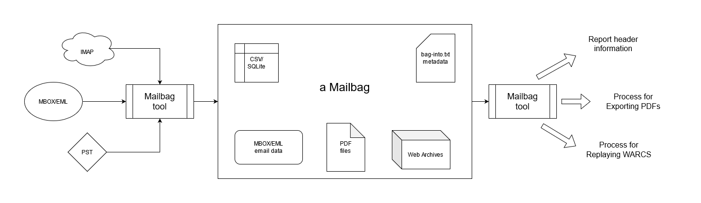

---
# Feel free to add content and custom Front Matter to this file.
# To modify the layout, see https://jekyllrb.com/docs/themes/#overriding-theme-defaults

layout: home
nav_order: 1
---

# Mailbag
{: .fs-9 }

A Stable Package for Email in Multiple Formats
{: .fs-6 .fw-300 }

[GitHub](https://github.com/UAlbanyArchives/mailbag){: .btn .btn-primary .fs-5 .mb-4 .mb-md-0 .mr-2 }

---

The Mailbag project aims to draft a specification and create an open source tool for preserving email archives using multiple formats, such as MBOX, PDF, and WARC.

Currently there is no single effective preservation format, so the Mailbag approach is to preserve multiple formats in a stable and computer-actionable package. MBOX or EML files provide structured access for computational use, PDF files preserve the document-like rendering of email well and provide easy dissemination, and web archives preserve the potential interactivity of email HTML and CSS, as well as embedded and linked Web content from external sources.

The Mailbag specification will be an extension  of the [Bagit specification](https://tools.ietf.org/html/rfc8493). A Mailbag will be a special type of "bag," with designated storage for common email exports like MBOX or PST, PDF files, and Web Archives. Mailbags will also contain specific metadata about its contents to enable them to be computer actionable, and potentially could include limited serialized email header data.

Many of the tools available for email processing are also challenging for many archivists to use. Email also must be processed near-to-capture, to ensure that content hosted on external servers is not lost. The project will also create a Mailbag tool which will enable archivists to rapidly process email archives and package them into Mailbags. A basic graphical user interface (GUI) will lower the barrier for this work.

### Acknowledgments

This project was made possible by funding from the University of Illinois's [Email Archives: Building Capacity and Community Project](https://emailarchivesgrant.library.illinois.edu/).

Hosted by the [M.E. Grenander Department of Special Collections & Archives](https://archives.albany.edu/), [University at Albany, SUNY](https://www.albany.edu)